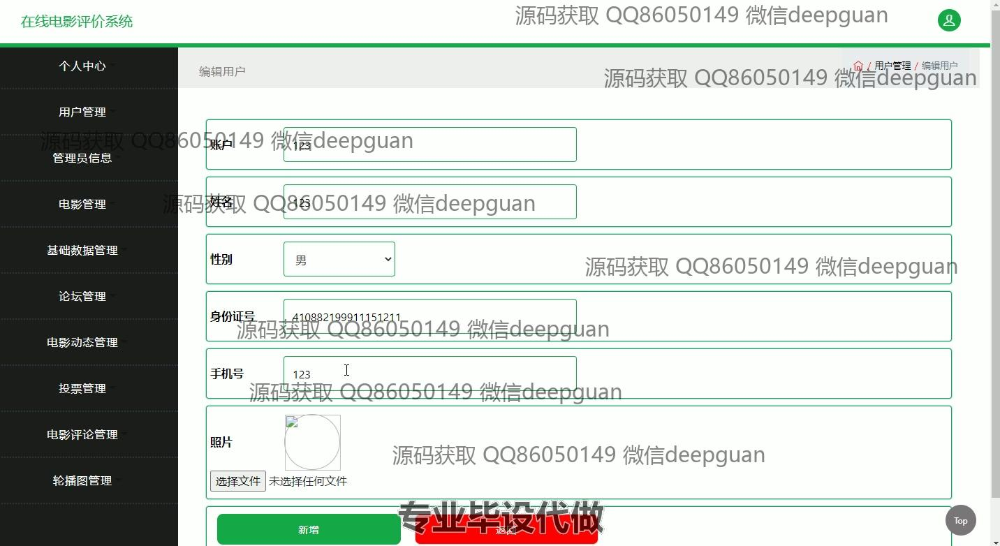

<h1 align="center">基于Spring MVC框架的在线电影评价系统</h1>

## 简介
基于Spring MVC框架的在线电影评价系统：用户可在主页、电影动态、论坛参与电影评论和评分，支持管理员进行用户、电影、评论的增删改查。    --计算机毕业设计源码；毕设源码；java毕业设计源码

## 联系方式

<h3 align="center">获取完整代码与数据库文件 + 微信：deepguan QQ: 86050149 QQ群: 783742310</h3>

<h3 align="center">可帮忙远程部署 包运行成功！提供远程部署、修改代码、设计文档指导、代码讲解等服务！</h3>

## 功能介绍（完整见运行截图）
管理员：管理员可以通过导航菜单访问系统的核心管理模块，包括用户管理、电影管理、评论管理、论坛管理和其他后台维护功能。管理员可以对所有电影和用户信息进行添加、修改、查询和删除操作，确保电影信息和用户数据的准确性和完整性，同时可以管理电影类型、电影动态和网站轮播图。管理员还可以编辑个人信息和账户安全信息（如修改密码），以保持系统安全。

用户：用户可以注册并登录系统访问个性化主页，浏览电影列表、查看电影详情和参与电影论坛。用户可撰写和提交电影评论，进行点赞和回复，提供评价和评分功能。个人中心允许用户管理自己的账户信息，包括更新个人基本信息和上传头像。用户可通过系统搜索电影，浏览和参与讨论，提高观影体验。整个用户界面设计简单直观，使用户能够轻松地参与交流和互动。

## 运行截图

本代码来源于网络,仅供学习参考使用!

